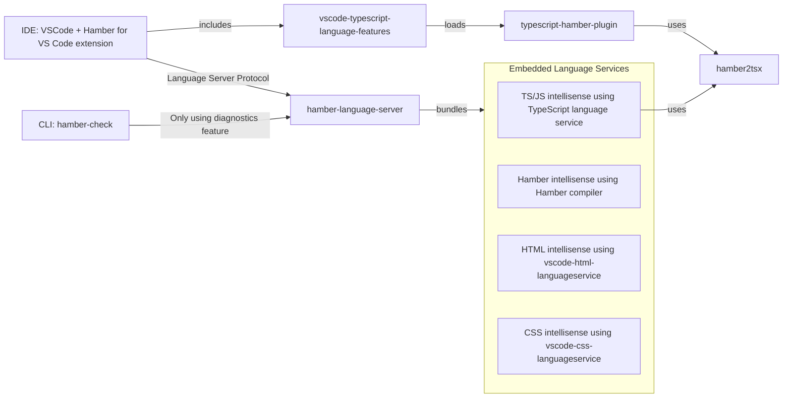

# Hamber Language Tools

## What is Hamber Language Tools?

Hamber Language Tools contains a library implementing the Language Server Protocol (LSP). LSP powers the [VSCode extension](https://marketplace.visualstudio.com/items?itemName=hamberjs.hamber-vscode), which is also hosted in this repository. Additionally, LSP is capable of powering plugins for [numerous other IDEs](https://microsoft.github.io/language-server-protocol/implementors/tools/).

A `.hamber` file would look something like this:

```html
<script>
    let count = 1;

    // the `$:` means 're-run whenever these values change'
    $: doubled = count * 2;
    $: quadrupled = doubled * 2;

    function handleClick() {
        count += 1;
    }
</script>

<button on:click="{handleClick}">Count: {count}</button>

<p>{count} * 2 = {doubled}</p>
<p>{doubled} * 2 = {quadrupled}</p>
```

Which is a mix of [HTMLx](https://github.com/htmlx-org/HTMLx) and vanilla JavaScript (but with additional runtime behavior coming from the hamber compiler).

This repo contains the tools which provide editor integrations for Hamber files like this.

## Packages

This repo uses [`yarn workspaces`](https://classic.yarnpkg.com/blog/2017/08/02/introducing-workspaces/), which TLDR means if you want to run a commands in each project then you can either `cd` to that directory and run the command, or use `yarn workspace [package_name] [command]`.

For example `yarn workspace hamber-language-server test`.

#### [`hamber-language-server`](packages/language-server)

The language server for Hamber.

#### [`hamber-check`](packages/hamber-check)

A command line tool to check your hamber files for type errors, unused css, and more.

#### [`hamber-vscode`](packages/hamber-vscode)

The official vscode extension for Hamber.

#### [`hamber2tsx`](packages/hamber2tsx)

Converts a `.hamber` file into a legal TypeScript file.

## Development

### High Level Overview



#### Setup

Pull requests are encouraged and always welcome. [Pick an issue](https://github.com/hamberjs/language-tools/issues?q=is%3Aissue+is%3Aopen+sort%3Aupdated-desc) and help us out!

To install and work on these tools locally:

> Make sure to uninstall the extension from the marketplace to not have it clash with the local one.

```bash
git clone https://github.com/hamberjs/language-tools.git hamber-language-tools
cd hamber-language-tools
yarn install
yarn bootstrap
```

> Do not use npm to install the dependencies, as the specific package versions in `yarn.lock` are used to build and test Hamber.

To build all of the tools, run:

```bash
yarn build
```

The tools are written in [TypeScript](https://www.typescriptlang.org/), but don't let that put you off — it's basically just JavaScript with type annotations. You'll pick it up in no time. If you're using an editor other than [Visual Studio Code](https://code.visualstudio.com/) you may need to install a plugin in order to get syntax highlighting and code hints etc.

#### Making Changes

There are two ways to work on this project: either by working against an existing project or entirely through tests.

## Running the Dev Language Server Against Your App

To run the developer version of both the language server and the VSCode extension:

-   open the root of this repo in VSCode
-   Go to the debugging panel
-   Make sure "Run VSCode Extension" is selected, and hit run

This launches a new VSCode window and a watcher for your changes. In this dev window you can choose an existing Hamber project to work against. When you make changes to the extension or language server you can use the command "Reload Window" in the VSCode command palette to see your changes. When you make changes to `hamber2tsx`, you first need to run `yarn build` within its folder.

## License

[MIT](LICENSE)
